# 磚牆照片分類和裁切說明
- [1.照片資料來源](#1.照片資料來源)
    - [1.1. 照片中的地震種類](#1.1.照片中的地震種類)
    - [1.2. 照片中原有數量](#1.2.照片中原有數量)
- [2. 磚牆分級方式](#2.磚牆分級方式)
    - [2.1 營建署磚牆分級示意](#2.1營建署磚牆分級示意)
- [3.磚牆照片篩選方式](#3.磚牆照片篩選方式)
    - [3.1.不合格照片圖例](#3.1.不合格照片圖例)
    - [3.2.合格照片示意](#3.2.合格照片示意)
- [4.裁切方式說明](#4.裁切方式說明)
    - [4.1.裁切要求](#4.1.裁切要求)
    - [4.2.裁切圖例](#4.2.裁切圖例)
    - [4.3.分類裁切後的牆體照片數量](#4.3.分類裁切後的牆體照片數量)
- [5.拍攝建議](#5.拍攝建議)
    - [5.1.合格照片示意](#5.1.合格照片示意)

## 1.照片資料來源

照片來源於datacenterhub的網站上，網址為https://datacenterhub.org/deedsdv/publications/view/454

### 1.1.照片中的地震種類
i. Duzce 1999

ii. Bingol 2003

iii. Peru 2007

iv. Wenchuan 2008

v. Haiti 2010

### 1.2.照片中原有數量

| 地震種類 | Duzce 1999 | Bingol 2003 | Peru 2007 |Wenchuan 2008| Haiti 2010 |總數|
|  :----:  |    :---:   |    :---:    |   :---:   |    :---:   |    :---:    |:---:|
| 建築數量 |  90        |    57       |    26     |      2      |     153      |328|
| 照片數量 |  647       |    1963     |    500    |      8      |     3635     |6753|

## 2.磚牆分級方式
將磚牆的照片依照損傷，參照營建署定義的等級，分到L1，L2，L3，L4和L5的資料夾。

### 2.1.營建署磚牆分級示意

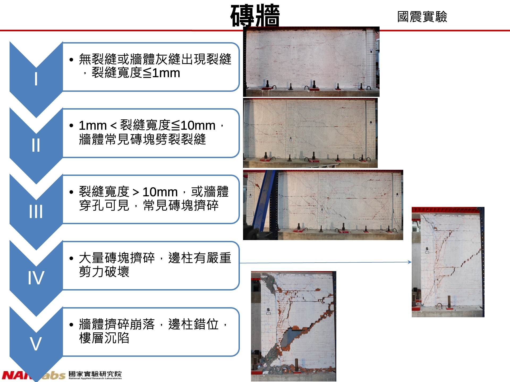

## 3.磚牆照片篩選方式
對於**模糊不清楚，過於局部**的照片都**不採納**。

### 3.1.不合格照片圖例
#### 3.1.1.模糊不清楚照片示意

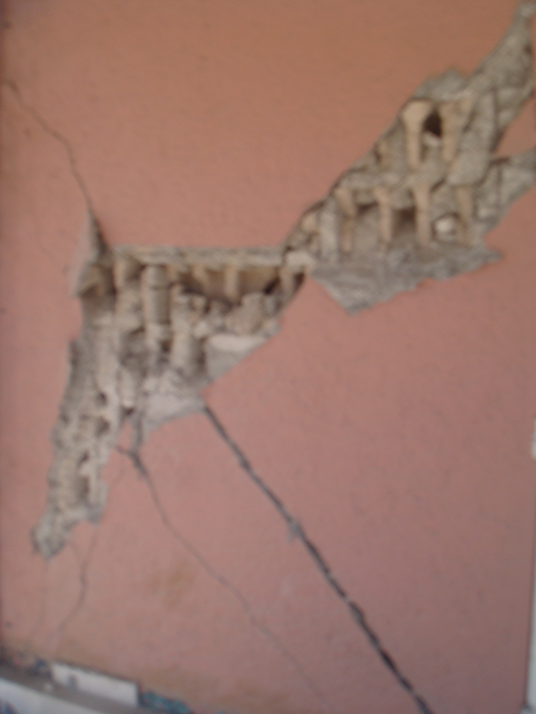

#### 3.1.2.過於局部照片示意

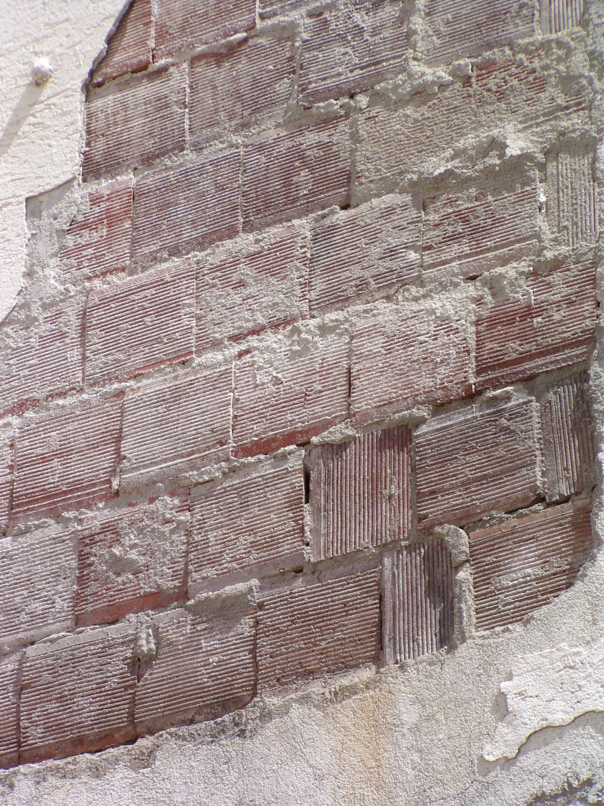

#### 3.1.3.角度不良照片示意

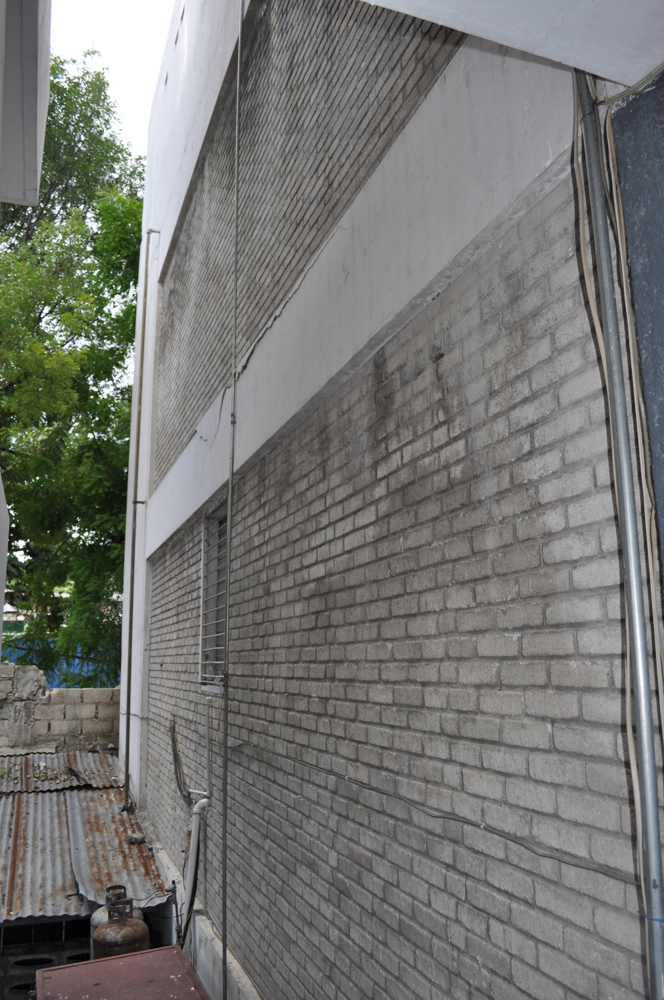

#### 3.1.4.大面積開窗牆不納入訓練
大面積開窗牆屬非結構承重牆
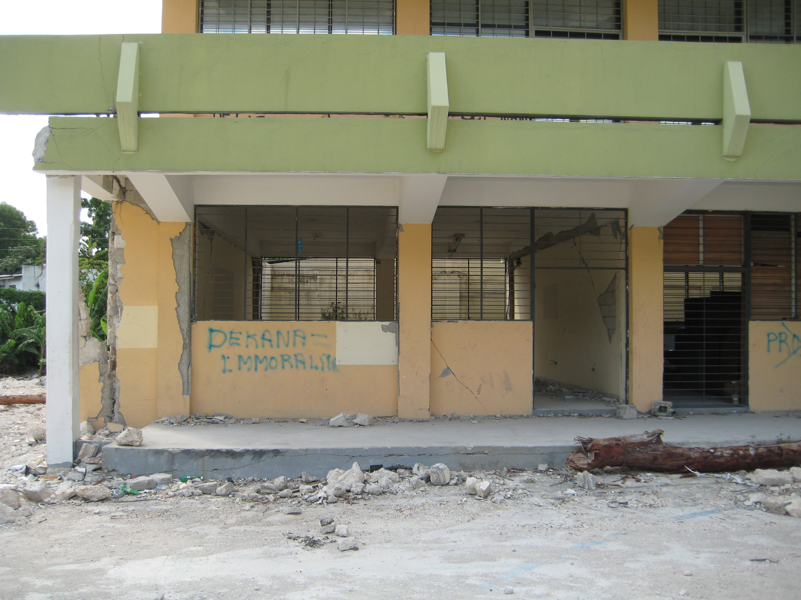

以上照片均不採用做訓練。

### 3.2.合格照片示意

#### 3.2.1.四面圍束牆不含窗口

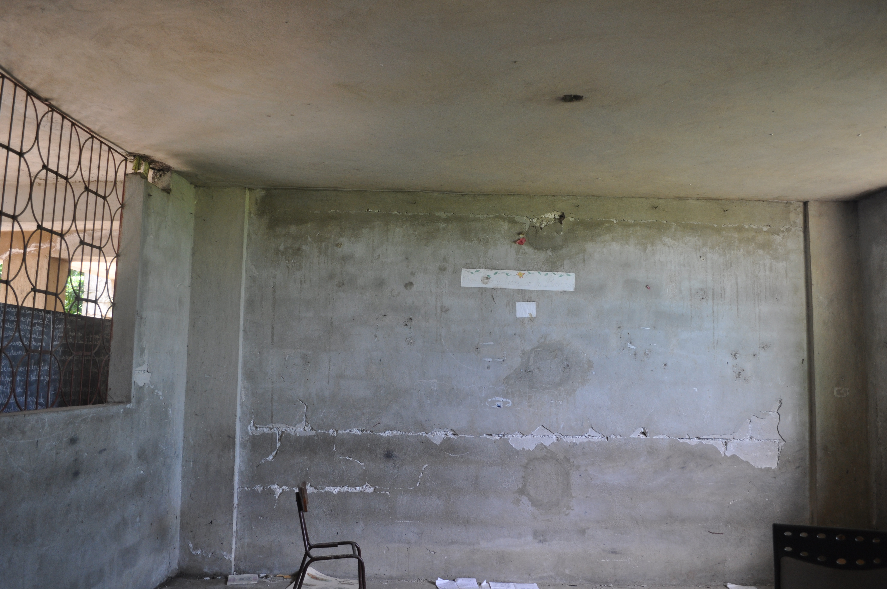

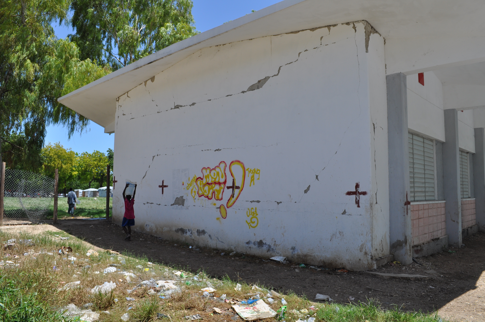

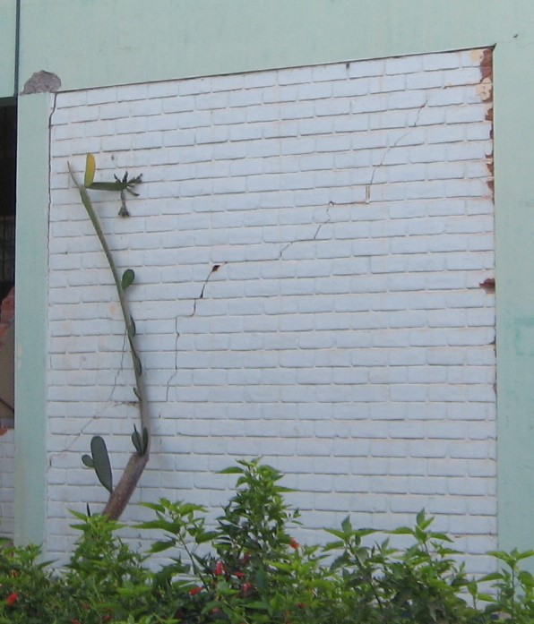

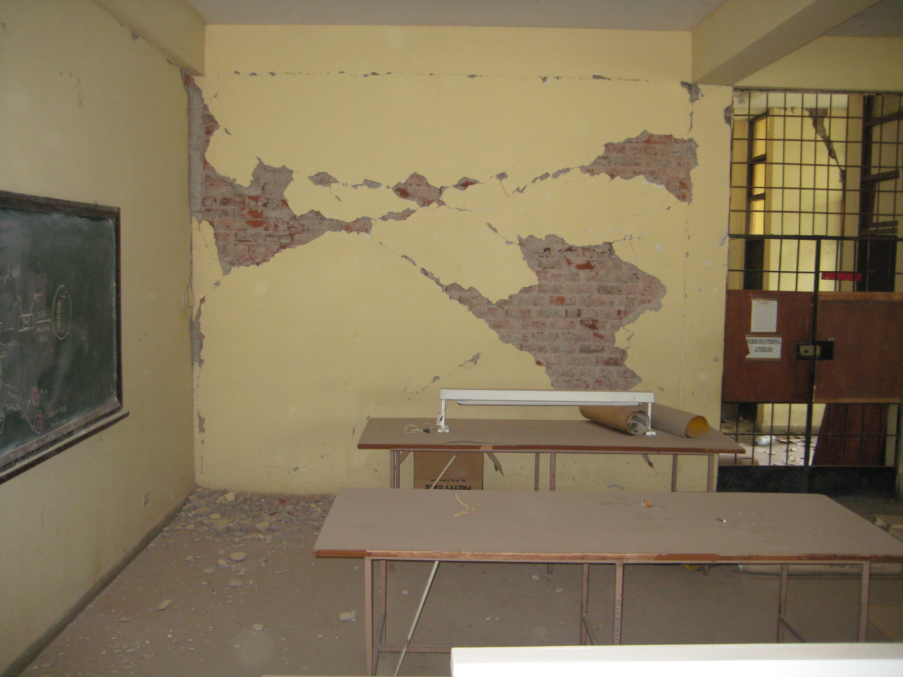

#### 3.2.2.四面圍束牆涵蓋窗口

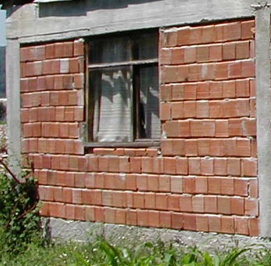

#### 3.2.3.三面圍束牆
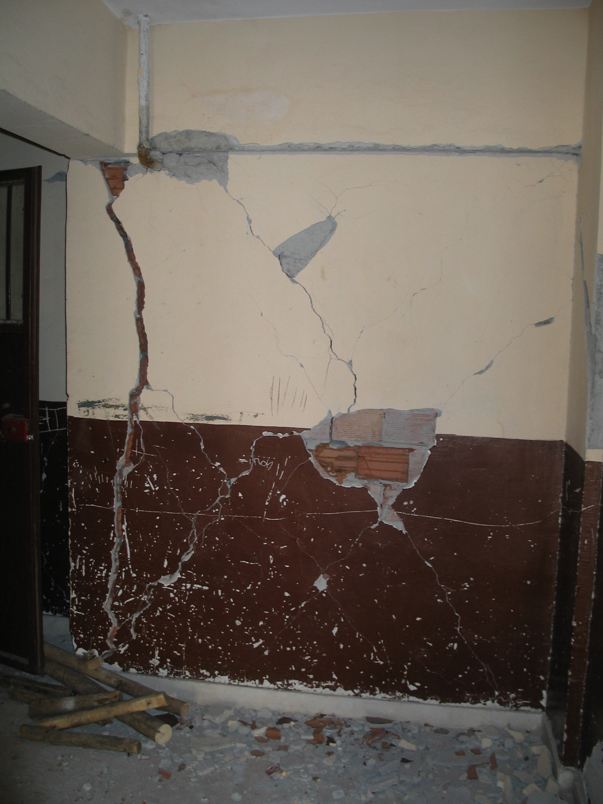

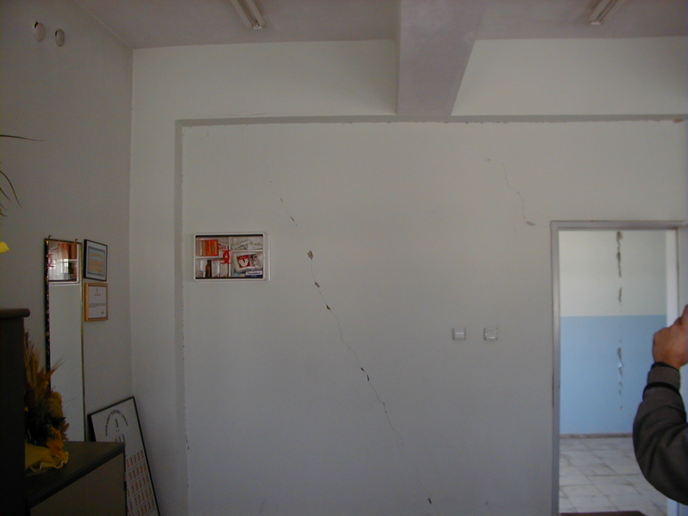

## 4.裁切方式說明

首先確認牆體在照片具體位置，然後裁切讓牆位於照片中心，並且不涵蓋其他雜物，同時保留牆體的邊界涵蓋柱和梁

### 4.1.裁切要求

i. 讓牆體整體位於照片**中心**。

ii. 拍攝時要距離牆體有一定距離，盡可能讓牆體邊界涵蓋柱子和梁

iii. 盡可能讓牆體佔比整張圖片的**50%以上**。

iv. 盡可能去掉避免將其他雜物涵蓋進去。

### 4.2.裁切圖例

#### 4.2.1.遇到牆體在畫面佔比不高或不位於中心的情況

讓牆體佔比整張圖片的**50%以上**。

#### 4.2.2.遇到畫面雜物繁多的情況

讓牆體位於照片中心，並且去除其他多餘雜物

#### 4.2.3.遇到畫面有多道牆體的情況

依照**樓層**分割牆體

### 4.3.分類裁切後的牆體照片數量
|震損分級|磚牆照片數量|
|---|---|
|L1|150|
|L2|305|
|L3|250|
|L4|95|
|L5|125|
|總數|925|

### 5.拍攝建議

i. 拍攝時讓牆體整體位於照片**中心**。

ii. 拍攝時要距離牆體有一定距離，盡可能讓牆體邊界涵蓋柱子和梁

iii. 拍攝時盡可能讓牆體佔比整張圖片的**50%以上**。

iv. 拍攝時盡可能去掉避免將其他雜物涵蓋進去。

#### 5.1.合格照片示意

