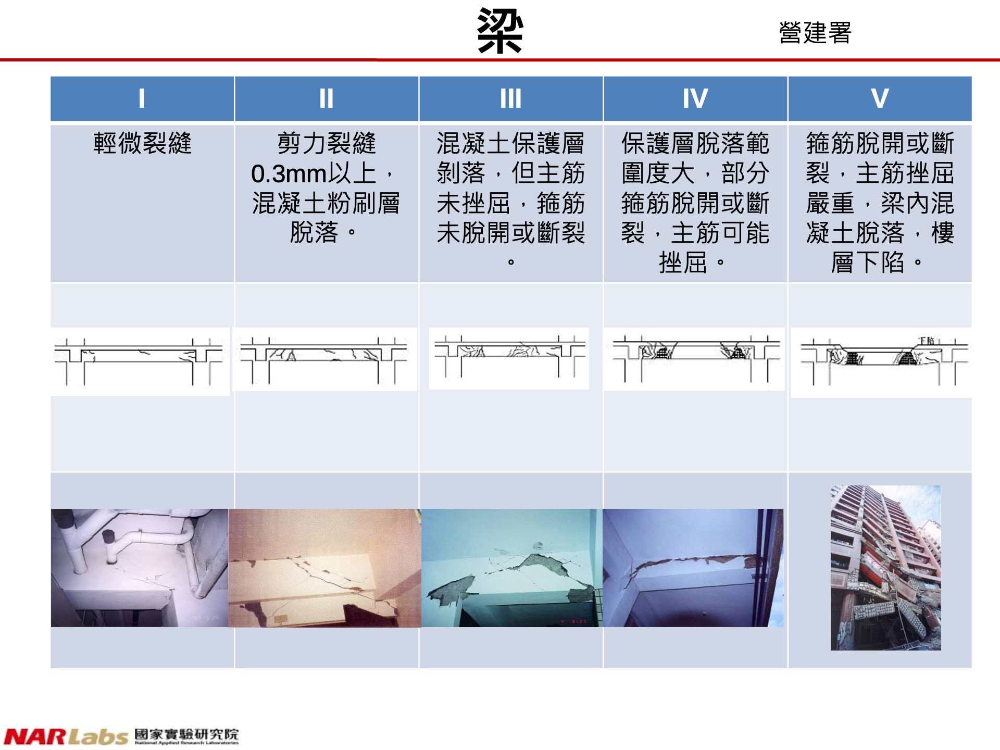
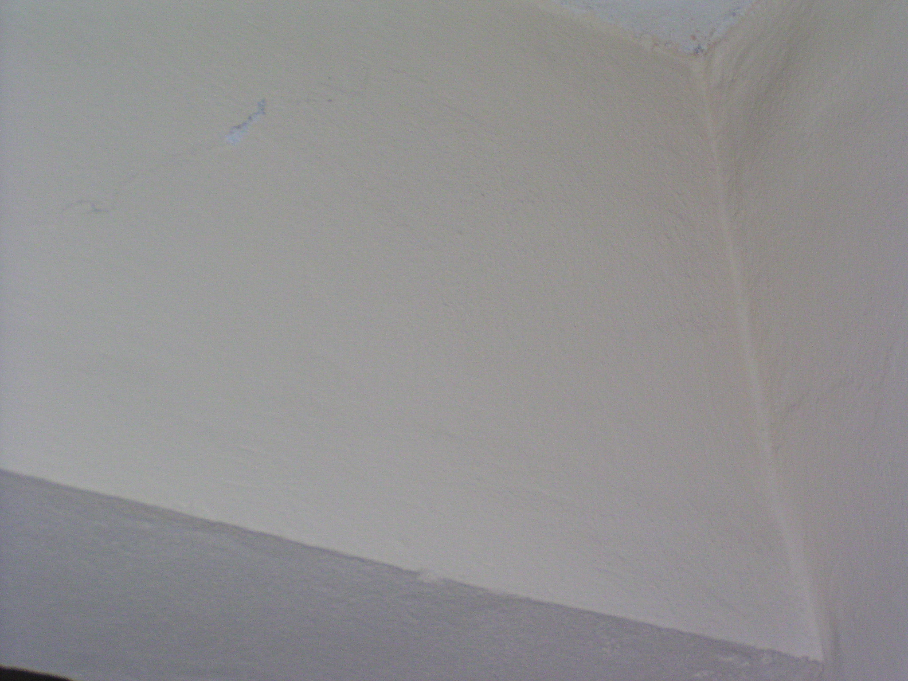
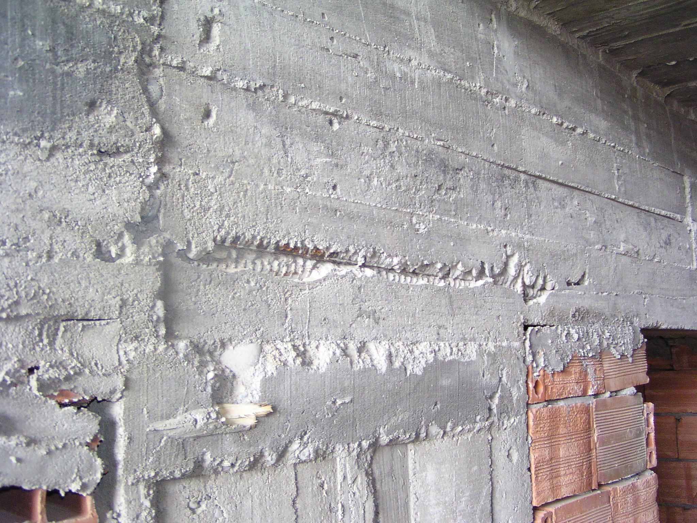
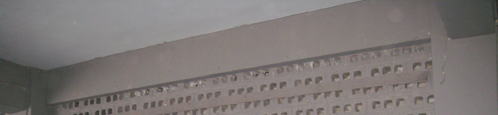
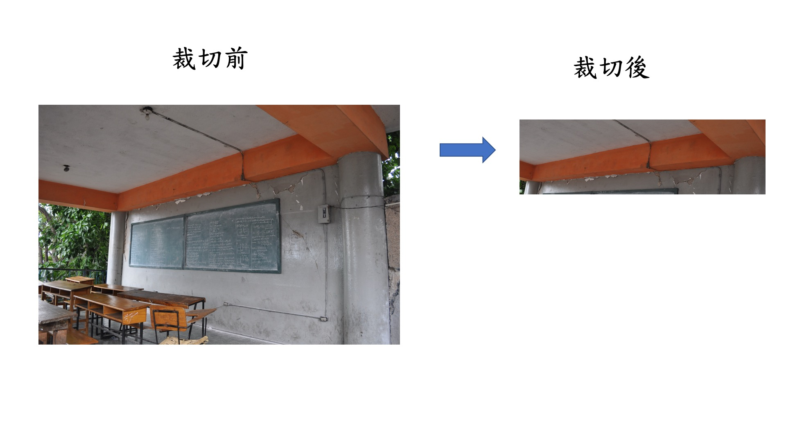
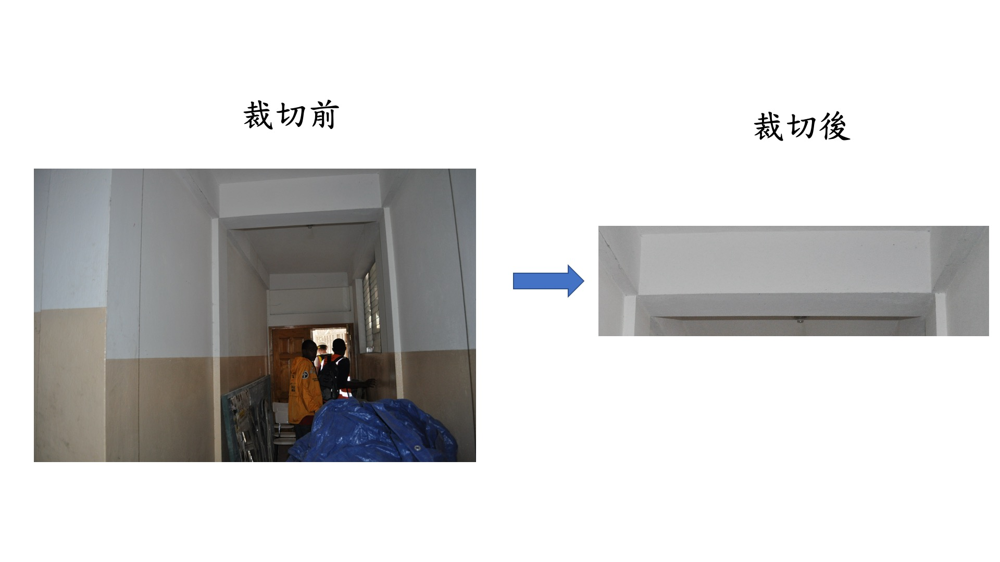

# 梁——照片分類和裁切說明

- [1.照片資料來源](#1.照片資料來源)
    - [1.1.照片中的地震種類](#1.1.照片中的地震種類)
    - [1.2.照片中原有數量](#1.2.照片中原有數量)
- [2. 梁分級方式](#2.梁分級方式)
    - [2.1.營建署梁分級示意](#2.1.營建署梁分級示意)
- [3.梁照片篩選方式](#3.梁照片篩選方式)
    - [3.1.照片圖例](#3.1.照片圖例)
- [4.裁切方式說明](#4.裁切方式說明)
    - [4.1.裁切要求](#4.1.裁切要求)
    - [4.2.裁切圖例](#4.2.裁切圖例)
    - [4.3.分類裁切後的梁照片數量](#4.3.分類裁切後的梁照片數量)
- [5.拍攝建議](#5.拍攝建議)
    - [5.1.合格照片示意](#5.1.合格照片示意)
    
## 1.照片資料來源

照片來源於datacenterhub的網站上，網址為https://datacenterhub.org/deedsdv/publications/view/454

### 1.1.照片中的地震種類
i. Duzce 1999

ii. Bingol 2003

iii. Peru 2007

iv. Wenchuan 2008

v. Haiti 2010

### 1.2.照片中原有數量

| 地震種類 | Duzce 1999 | Bingol 2003 | Peru 2007 |Wenchuan 2008| Haiti 2010 |總數|
|  :----:  |    :---:   |    :---:    |   :---:   |    :---:   |    :---:    |:---:|
| 建築數量 |  90        |    57       |    26     |      2      |     153      |328|
| 照片數量 |  647       |    1963     |    500    |      8      |     3635     |6753|

## 2.梁分級方式
將柱子的照片依照損傷，參照營建署定義的等級，分到L1，L2，L3，L4和L5的資料夾。

### 2.1.營建署梁分級示意

## 3.梁照片篩選方式
對於**模糊不清楚，過於局部**的照片都**不採納**。

### 3.1.照片圖例

#### 3.1.1.過於局部照片示意

以上照片均不採用做訓練。

## 4.裁切方式說明

首先確認梁在照片具體位置，然後裁切讓梁位於照片中心，並且不涵蓋其他雜物。

### 4.1.裁切要求

i. 讓梁位於照片**中心**。

ii. 拍攝時要距離梁有一定距離，盡可能涵蓋梁左右兩段的**柱子**，同時看的到上下的邊界。

iii. 盡可能讓梁佔比整張圖片的**50%以上**。

iv. 盡可能去掉避免將其他雜物涵蓋進去。

### 4.2.裁切圖例

#### 4.2.1.遇到梁在畫面佔比不高的情況

#### 4.2.2.遇到畫面雜物繁多的情況

#### 4.2.3.遇到懸臂樑

#### 4.3.分類裁切後的梁照片數量
|震損分級|梁照片數量|
|---|---|
|L1|243|
|L2|75|
|L3|38|
|L4|20|
|L5|6|
|總數|382|

#### 5.拍攝建議

i. 讓梁位於照片**中心**。

ii. 拍攝時要距離梁有一定距離，盡可能涵蓋梁左右兩段的**柱子**，同時看的到**梁頂上的天花板和梁底下部分牆體或空隙**作為邊界。

iii. 盡可能讓梁佔比整張圖片的**50%以上**。

iv. 盡可能去掉避免將其他雜物涵蓋進去。

#### 5.1.合格照片示意

