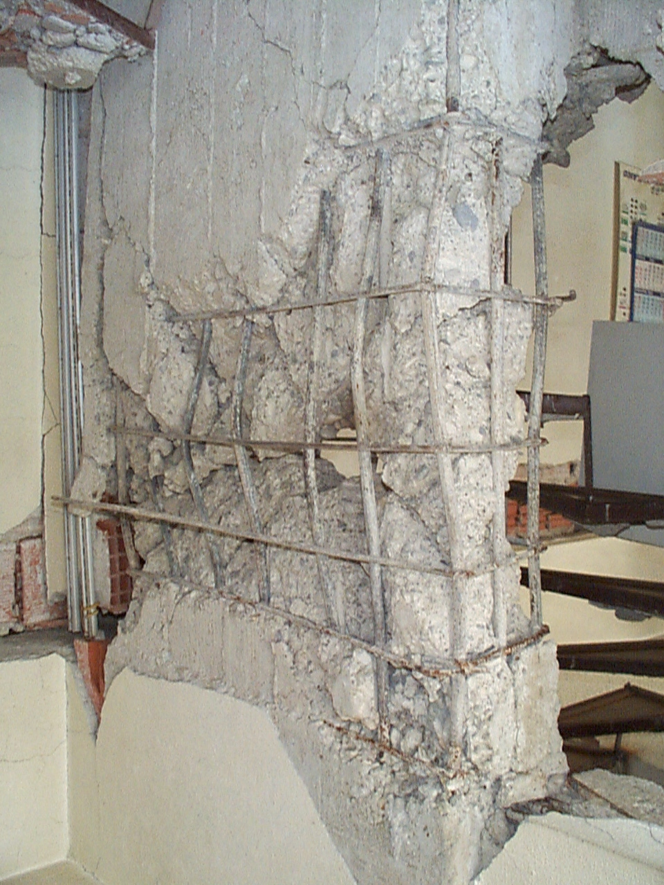

# RC Wall Photo Classification, Cropping and Shooting Instructions

- [1.Photo Data Source](#1.Photo-Data-Source)
    - [1.1.Types of Earthquakes in the Photos](#1.1.Types-of-Earthquakes-in-the-Photos)
    - [1.2.Original Quantities of the Photos](#1.2.Original-Quantities-of-the-Photos)
- [2.RC Wall Grading Method](#2.RC-Wall-Grading-Method)
    - [2.1.Illustration of RC Wall Grading by the National Land Management Agency, MOI](#2.1.Illustration-of-RC-Wall-Grading-by-the-National-Land-Management-Agency,-MOI)
- [3.RC Wall Photo Filtering Criteria](#3.RC-Wall-Photo-Filtering-Criteria)
    - [3.1.Examples of Unacceptable Photos](#3.1.Examples-of-Unacceptable-Photos)
    - [3.2.Acceptable Photo Representation](#3.2.Acceptable-Photo-Representation)
- [4.Cropping Instructions](#4.Cropping-Instructions)
    - [4.1.Cropping Requirements](#4.1.Cropping-Requirements)
    - [4.2.Cropping Examples](#4.2.Cropping-Examples)
    - [4.3.Number of Classified and Cropped Wall Photos](#4.3.Number-of-Classified-and-Cropped-Wall-Photos)
- [5.Photo Shooting Recommendations](#5.Photo-Shooting-Recommendations)
    - [5.1.Representation of Acceptable Photos](#5.1.Representation-of-Acceptable-Photos)

## 1.Photo Data Source

The photos are sourced from the website of **datacenterhub**, with the URLhttps://datacenterhub.org/deedsdv/publications/view/454

### 1.1.Types of Earthquakes in the Photos
i. Duzce 1999

ii. Bingol 2003

iii. Peru 2007

iv. Wenchuan 2008

v. Haiti 2010

### 1.2.Original Quantities of the Photos

| Earthquake Type | Duzce 1999 | Bingol 2003 | Peru 2007 |Wenchuan 2008| Haiti 2010 |Total|
|  :----:  |    :---:   |    :---:    |   :---:   |    :---:   |    :---:    |:---:|
| Number of Buildings |  90        |    57       |    26     |      2      |     153      |328|
| Number of Photos |  647       |    1963     |    500    |      8      |     3635     |6753|

## 2.RC Wall Grading Method
Classify the photos of RC walls into folders labeled L1, L2, L3, L4, and L5 according to the level of damage, referencing the definitions provided by the National Land Management Agency, MOI.

### 2.1.Illustration of RC Wall Grading by the National Land Management Agency, MOI

## 3.RC Wall Photo Filtering Criteria
Photos that are **blurry** or **overly localized** are not accepted.

### 3.1.Examples of Unacceptable Photos
#### 3.1.1.Representation of Blurry Photos

#### 3.1.2.Representation of Overly Localized Photos

#### 3.1.3.Representation of Bad angle photo

#### 3.1.4.Walls with large windows are not included in training
Walls with large windows are non-structural walls

The above photos are not use for training.

### 3.2.Acceptable Photo Representation

## 4.Cropping Instructions

First, identify the exact location of the wall in the photo. Then, crop the photo so that the wall is centered and does not include any other clutter. Ensure to retain the boundaries of the wall, including columns and beams.

### 4.1.Cropping Requirements

i.  Ensure that the entire wall is **centered** in the photo.

ii. When taking the photo, maintain a certain distance from the wall to include as much of the wall's boundaries, including columns and beams, as possible.

iii. Aim to have the wall occupy more than **50%** of the entire picture.

iv. Try to avoid including other clutter in the photo.

### 4.2.Cropping Examples

#### 4.2.1.When encountering situations where the wall does not occupy a significant portion of the frame or is not centered.

Let the wall occupy more than **50%** of the entire picture.

#### 4.2.2.When encountering a situation with a lot of clutter in the frame.

Center the wall in the photo and remove any unnecessary clutter.

#### 4.2.3.When encountering multiple walls in the frame.

Divide the walls according to **floors**.

### 4.3.Number of Classified and Cropped Wall Photos
|Damage Grade|Brick Wall Photo Count|
|---|---|
|L1|32|
|L2|58|
|L3|44|
|L4|17|
|L5|15|
|Total|166|

### 5.Photo Shooting Recommendations

i. When shooting, ensure that the entire wall is positioned at the **center** of the photo.

ii. Maintain a certain distance from the wall when shooting to include as much of the wall's boundaries, including columns and beams, as possible.

iii. Aim to have the wall occupy more than **50%** of the entire picture when shooting.

iv. Try to avoid including other clutter in the photo when shooting.

#### 5.1.Representation of Acceptable Photos

