# Beam Photo Classification, Cropping and Shooting Instructions
- [1.Photo Data Source](#1.Photo-Data-Source)
    - [1.1.Types of Earthquakes in the Photos](#1.1.Types-of-Earthquakes-in-the-Photos)
    - [1.2.Original Quantities of the Photos](#1.2.Original-Quantities-of-the-Photos)
- [2.Beam Grading Method](#2.Beam-Grading-Method)
    - [2.1.Illustration of Beam Grading by the National Land Management Agency, MOI](#2.1.Illustration-of-Beam-Grading-by-the-National-Land-Management-Agency,-MOI)
- [3.Beam Photo Filtering Criteria](#3.Beam-Photo-Filtering-Criteria)
    - [3.1.Examples of Unacceptable Photos](#3.1.Examples-of-Unacceptable-Photos)
- [4.Cropping Instructions](#4.Cropping-Instructions)
    - [4.1.Cropping Requirements](#4.1.Cropping-Requirements)
    - [4.2.Cropping Examples](#4.2.Cropping-Examples)
    - [4.3.The Beam photo after Cropping and filtering](#4.3.The-Beam-photo-after-Cropping-and-filtering)
- [5.Photo Shooting Recommendations](#5.Photo-Shooting-Recommendations)
    - [5.1.Representation of Acceptable Photos](#5.1.Representation-of-Acceptable-Photos)

## 1.Photo Data Source
Photo Data Source: datacenterhub，with the URL https://datacenterhub.org/deedsdv/publications/view/454

### 1.1.Types of Earthquakes in the Photos
i. Duzce 1999

ii. Bingol 2003

iii. Peru 2007

iv. Wenchuan 2008

v. Haiti 2010

### 1.2.Original Quantities of the Photos

| Types of Earthquakes| Duzce 1999 | Bingol 2003 | Peru 2007 |Wenchuan 2008| Haiti 2010 |Total|
|  :----:  |    :---:   |    :---:    |   :---:   |    :---:   |    :---:    |:---:|
| Number of Buildings |  90        |    57       |    26     |      2      |     153      |328|
| Number of Photos |  647       |    1963     |    500    |      8      |     3635     |6753|

## 2.Beam Grading Method
Classify the photos of beam into folders labeled L1, L2, L3, L4, and L5 according to the level of damage, referencing the definitions provided by the National Land Management Agency, MOI.

### 2.1.Illustration of Beam Grading by the National Land Management Agency, MOI

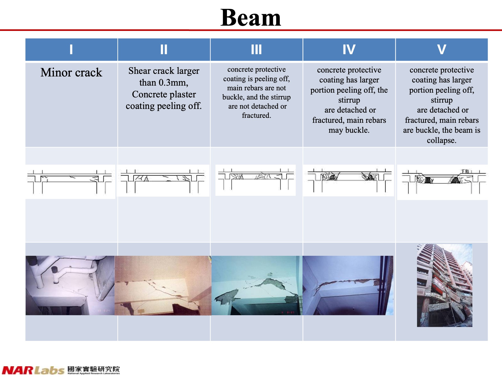

## 3.Beam Photo Filtering Criteria
Photos that are **blurry** or **overly localized** are not accepted.

### 3.1.Examples of Unacceptable Photos

#### 3.1.1.Representation of Overly Localized Photos

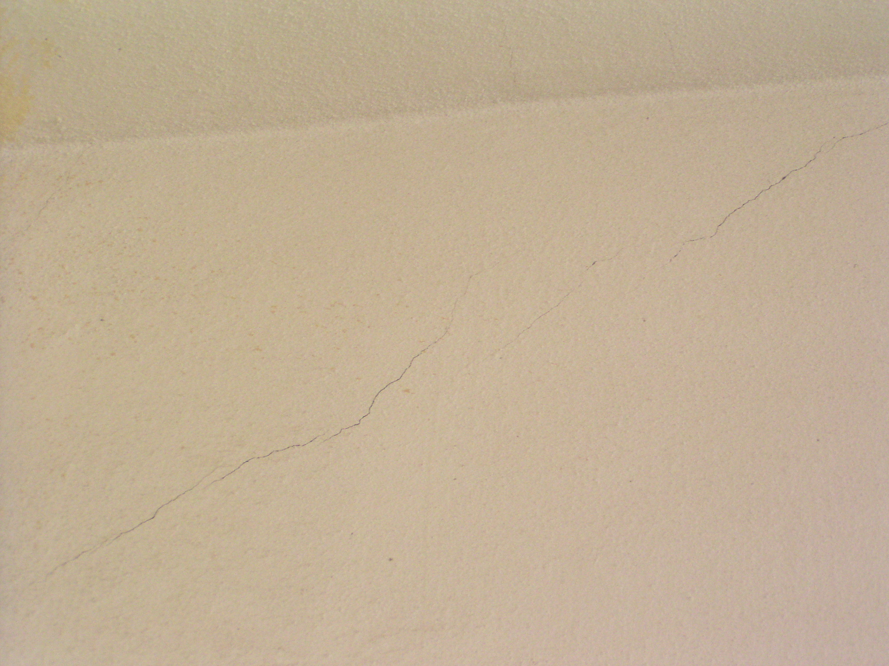

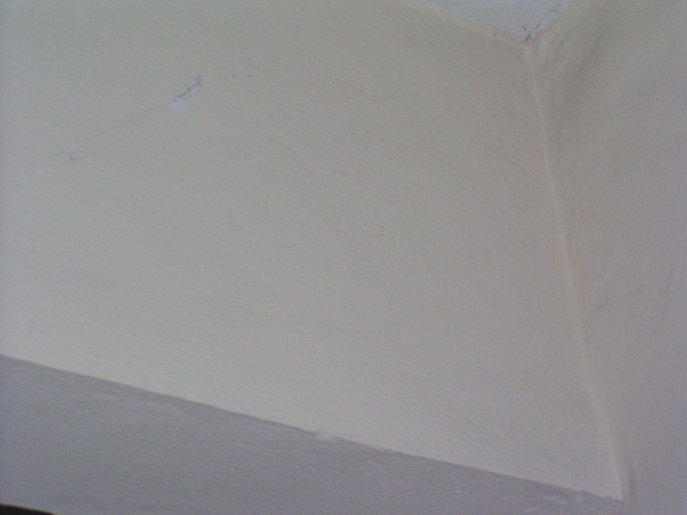

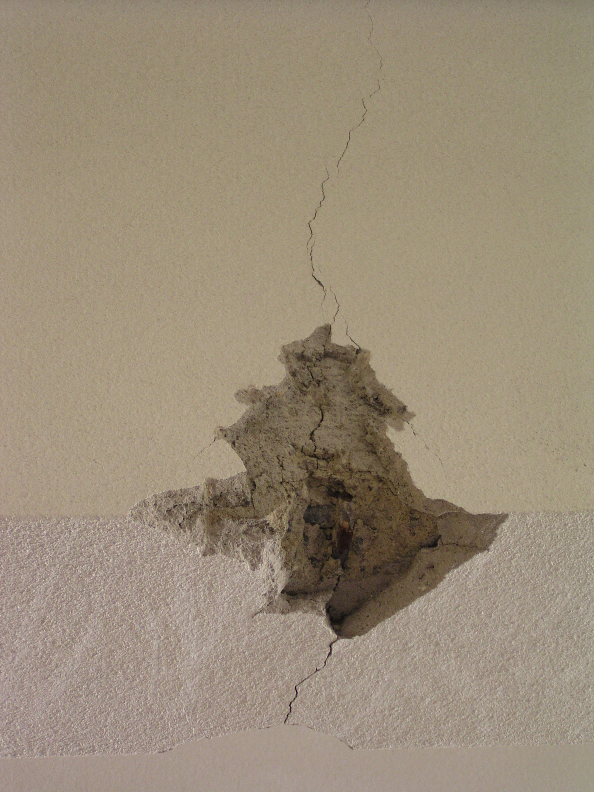

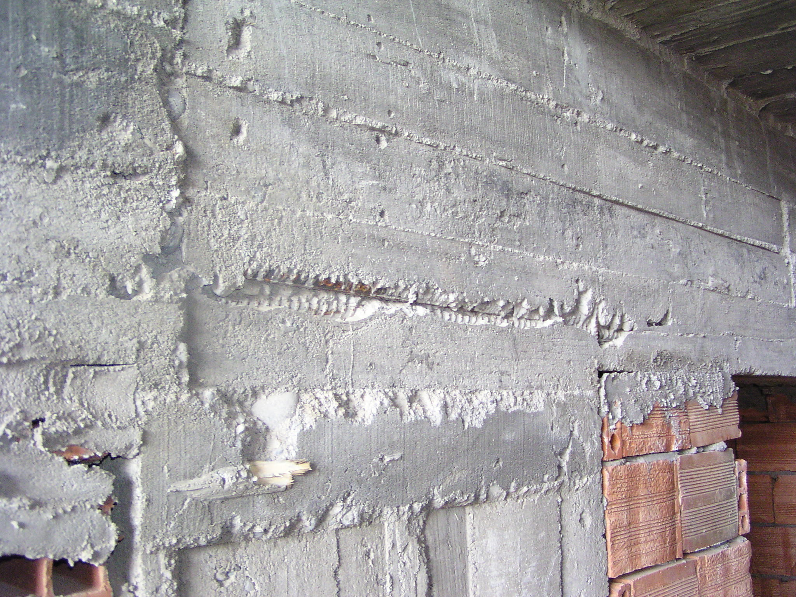

The above photos are not use for training.

## 4.Cropping Instructions

First, confirm the position of the beam in the photo, and then use cropping to place the beam in the exact center of the photo. Additionally, try to minimize the impact of other clutter on the composition of the image.

### 4.1.Cropping Requirements

- Ensure that the beam is **centered** in the photo.

- 
- Maintain a certain distance from the beam when shooting, aiming to include both the **top and bottom of the column** as much as possible.

- Strive to have the beam occupy more than **50%** of the entire picture.

- Remove background noise and avoid including other clutter in the photo.

### 4.2.Cropping Examples

#### 4.2.1.When the beam occupies a small portion of the frame.

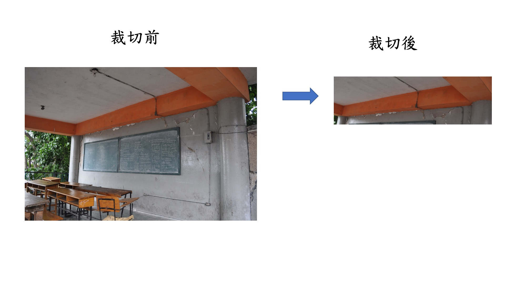

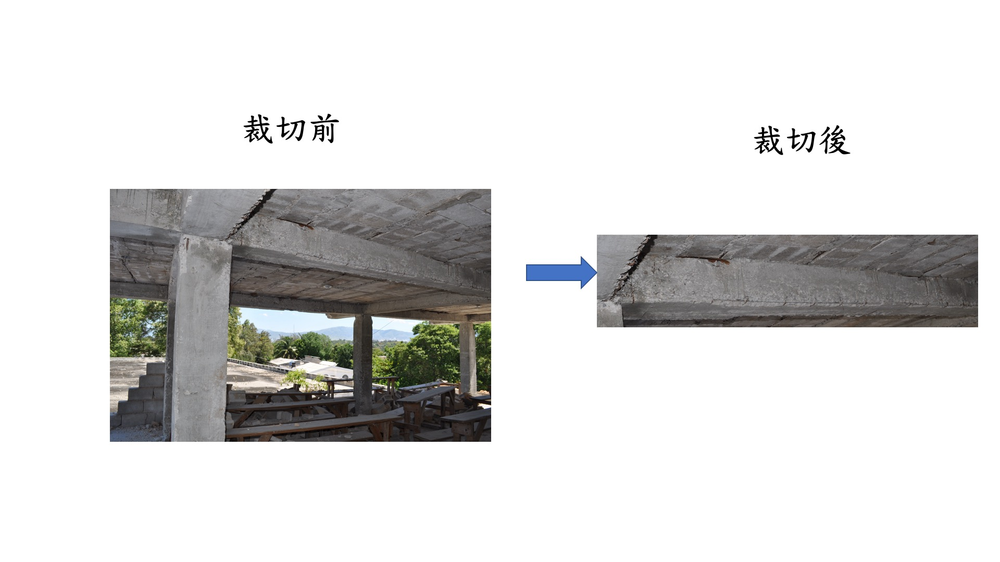

#### 4.2.2.When encountering a situation with a lot of clutter in the frame.

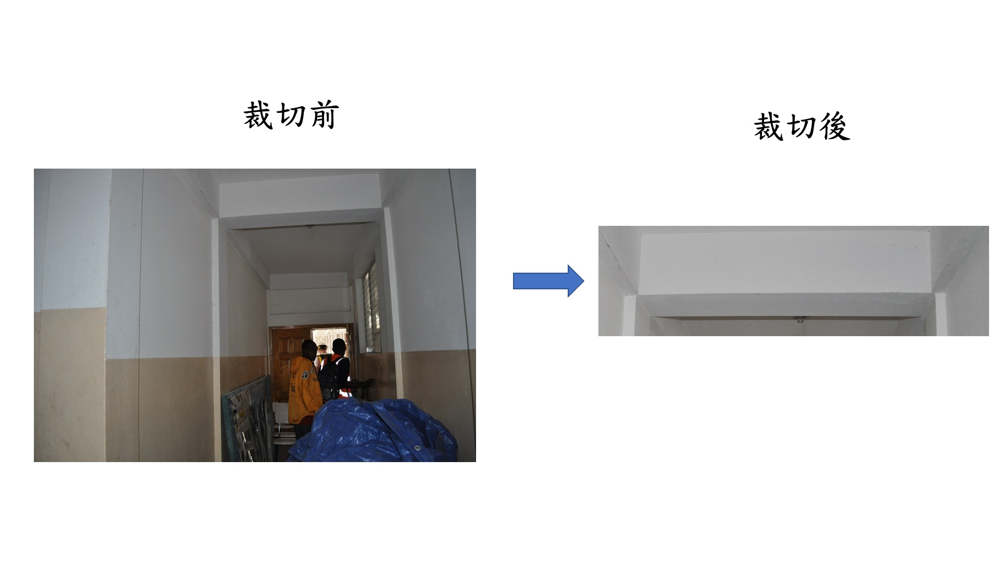

#### 4.2.3.When encountering cantilever beam in the frame.

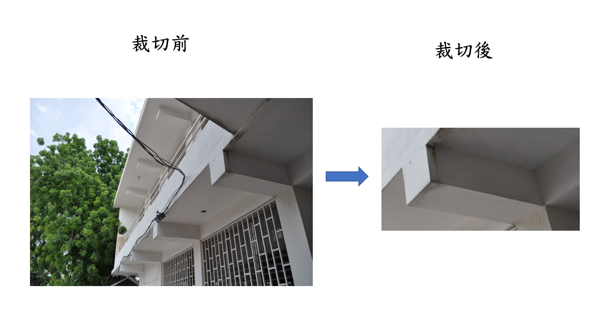

#### 4.3.The Beam photo after Cropping and filtering
|Damage Grade|Beam Photo Count|
|---|---|
|L1|243|
|L2|75|
|L3|38|
|L4|20|
|L5|6|
|Total|382|

#### 5.Photo Shooting Recommendations

- **Ensure Centering**: Make sure the beam is centered in the frame when shooting.

- During shooting, there should be a certain distance from the beam, covering the **pillars on both sides of the beam** as much as possible, while also being able to see the upper and lower boundaries.

- Try to ensure that the beam occupies more than 50% of the entire image.

- Try to remove other clutter to avoid including them.

#### 5.1.Representation of Acceptable Photos

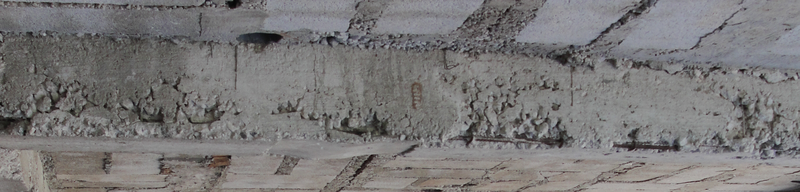

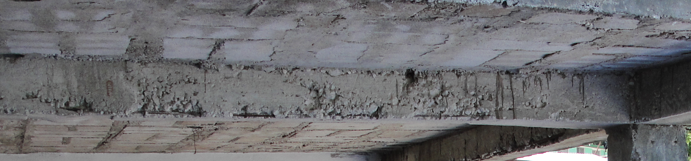

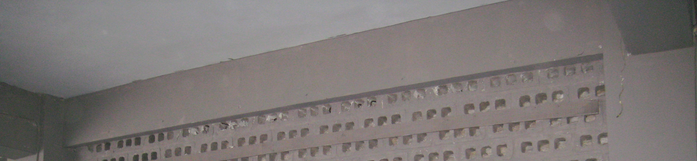
