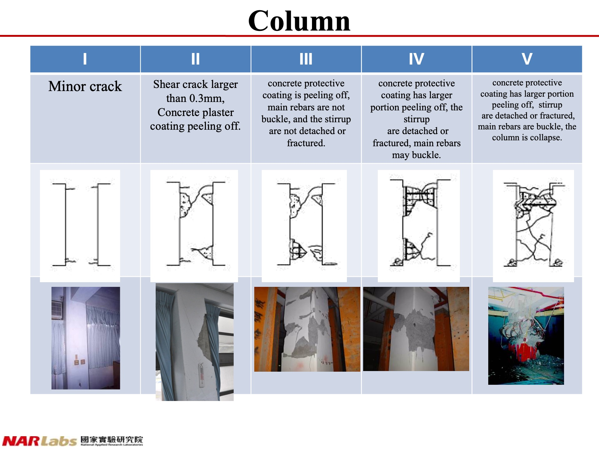
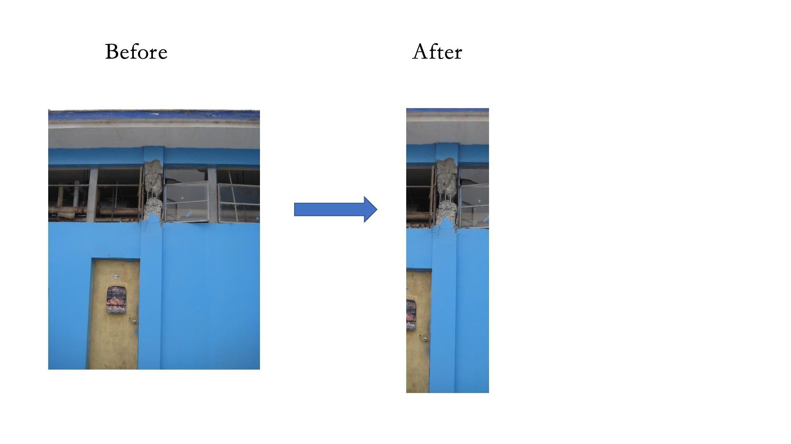
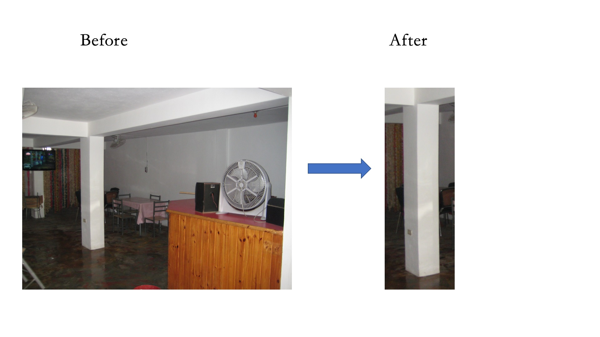
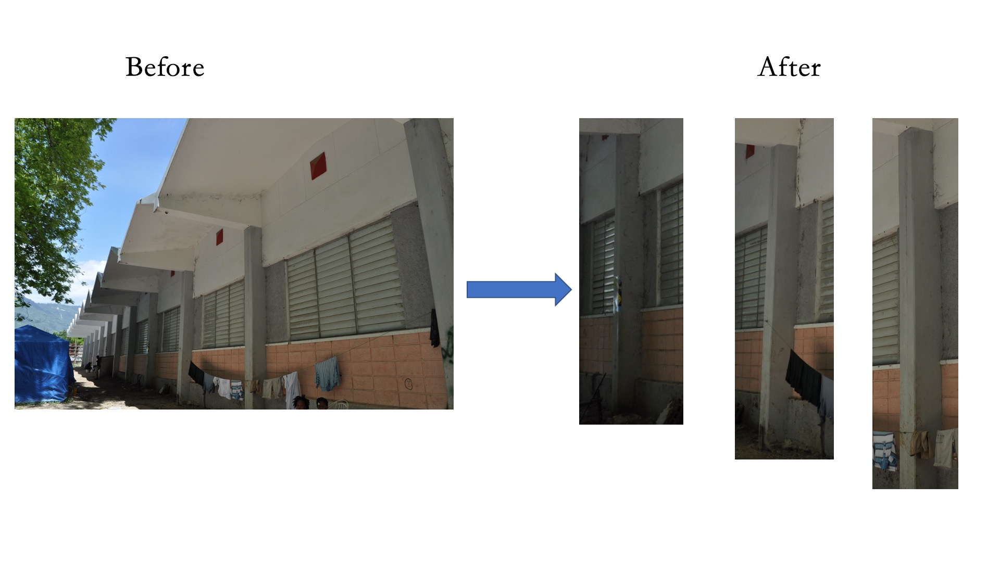

# Column Photo Classification, Cropping Instructions and Shooting Recommendations
- [Column Photo Classification, Cropping Instructions and Shooting Recommendations](#Column-Photo-Classification,-Cropping-Instructions-and-Shooting-Recommendations)
  - [1.Photo Data Source](#1.Photo-Data-Source)
    - [1.1.Types of Earthquakes and Original Quantities of the Photos](#1.1.Types-of-Earthquakes-and-Original-Quantities-of-the-Photos)
  - [2. Column Grading Method](#2.Column-Grading-Method)
    - [2.1.Illustration of Column Grading by the National Land Management Agency, MOI](#2.1.Illustration-of-Column-Grading-by-the-National-Land-Management-Agency,-MOI)
  - [3.Column Photo Filtering Criteria](#3.Column-Photo-Filtering-Criteria)
    - [3.1.Examples of Unacceptable Photos](#3.1.Examples-of-Unacceptable-Photos)
      - [3.1.1.Representation of Blurry Photos](#3.1.1.Representation-of-Blurry-Photos)
      - [3.1.2.Representation of Overly Localized Photos](#3.1.2.Representation-of-Overly-Localized-Photos)
  - [4.Cropping Instructions](#4.Cropping-Instructions)
    - [4.1.Cropping Requirements](#4.1.Cropping-Requirements)
    - [4.2.Cropping Examples](#4.2.Cropping-Examples)
      - [4.2.1.When the column occupies a small portion of the frame.](#4.2.1.When-the-column-occupies-a-small-portion-of-the-frame.)
      - [4.2.2.When encountering a situation with a lot of clutter in the frame.](#4.2.2.When-encountering-a-situation-with-a-lot-of-clutter-in-the-frame.)
      - [4.2.3.When encountering multiple columns in the frame.](#4.2.3.When-encountering-multiple-columns-in-the-frame.)
      - [4.3.The Column photo after Cropping and filtering](#4.3.The-Column-photo-after-Cropping-and-filtering)
  - [5.Photo Shooting Recommendations](#5.Photo-Shooting-Recommendations)

## 1.Photo Data Source

Photo Data Source: datacenterhub，with the URL https://datacenterhub.org/deedsdv/publications/view/454

### 1.1.Types of Earthquakes and Original Quantities of the Photos

| Types of Earthquakes | Duzce 1999 | Bingol 2003 | Peru 2007 |Wenchuan 2008| Haiti 2010 |Total|
|  :----:  |    :---:   |    :---:    |   :---:   |    :---:   |    :---:    |:---:|
| Number of Buildings |  90        |    57       |    26     |      2      |     153      |328|
| Number of Photos |  647       |    1963     |    500    |      8      |     3635     |6753|

## 2.Column Grading Method
Classify the photos of column into folders labeled L1, L2, L3, L4, and L5 according to the level of damage, referencing the definitions provided by the National Land Management Agency, MOI.

### 2.1.Illustration of Column Grading by the National Land Management Agency, MOI

## 3.Column Photo Filtering Criteria
Photos that are **blurry** or **overly localized** are not accepted.

### 3.1.Examples of Unacceptable Photos
#### 3.1.1.Representation of Blurry Photos

#### 3.1.2.Representation of Overly Localized Photos

**The above photos are not use for training.**

## 4.Cropping Instructions

First, confirm the position of the column in the photo, and then use cropping to place the column in the exact center of the photo. Additionally, try to minimize the impact of other clutter on the composition of the image.

### 4.1.Cropping Requirements

- Ensure that the entire column is **centered** in the photo.

- Maintain a certain distance from the column when shooting, aiming to include both the **top and bottom of the column** as much as possible.

- Strive to have the column occupy more than **50%** of the entire picture.

- Remove background noise and avoid including other clutter in the photo.

### 4.2.Cropping Examples

#### 4.2.1.When the column occupies a small portion of the frame.

#### 4.2.2.When encountering a situation with a lot of clutter in the frame.

#### 4.2.3.When encountering multiple columns in the frame.

#### 4.3.The Column photo after Cropping and filtering
|Damage Grade|Column Photo Count|
|---|---|
|L1|185|
|L2|292|
|L3|253|
|L4|202|
|L5|368|
|Total|1300|

## 5.Photo Shooting Recommendations
According to professional advice, the key points for photographing columns are as follows:

- **Ensure Centering**: Make sure the column is centered in the frame when shooting.
- **Cover Top and Bottom**: It's preferable for the photo to include both the top and bottom of the column.
- **Column Proportion**: The column should occupy more than 50% of the photo.
- **Avoid Clutter**: Minimize distracting elements in the background and focus the lens on the column itself.
